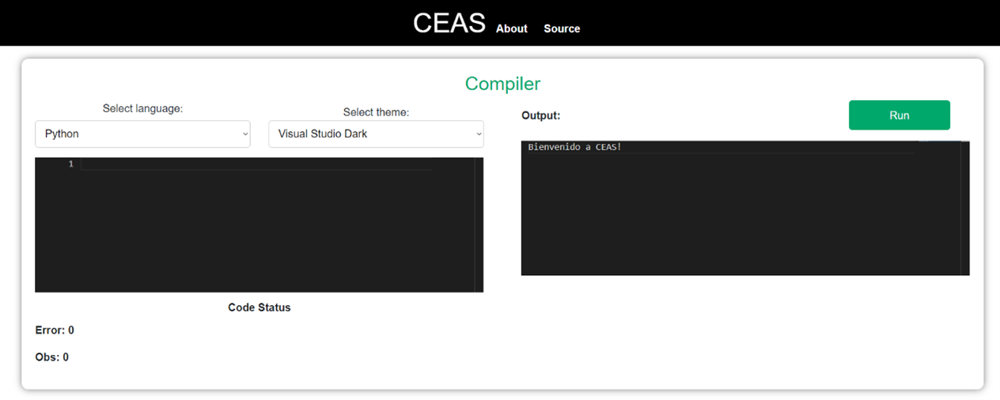
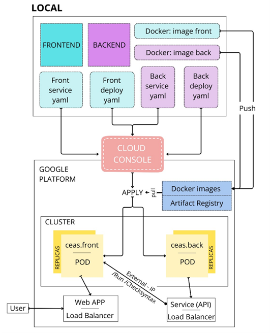

# Ejecución de Código como Servicio | CEAS

# Resumen

Se ha desarrollado una aplicación con un servicio backend en Dotnet y un frontend en Dotnet Blazor, desplegados en Google Kubernetes. Este informe destaca la capacidad de escalabilidad y autoescalado del sistema, aprovechando Kubernetes como orquestador de contenedores y un balanceador de carga para distribuir eficientemente el tráfico. Se explora cómo estas tecnologías mejoran el rendimiento, la disponibilidad y la gestión de recursos, proporcionando una infraestructura ágil y eficaz en la nube.

## BackEnd 

Se compone de dos servicios esenciales. En primera instancia, un servicio de verificación de sintaxis de código, diseñado para responder a solicitudes POST y validar la estructura y formato del código suministrado. Este servicio permite llevar a cabo una verificación eficiente antes de la ejecución del código, garantizando la integridad de su composición. En segundo lugar, hemos desplegado un servicio de ejecución de código que, también mediante solicitudes POST, posibilita la ejecución segura y controlada de scripts proporcionados. Ambos servicios desempeñan un papel crucial en el flujo operativo de la aplicación, proporcionando una capa robusta y segura para la verificación y ejecución de código. Su combinación contribuye de manera integral a la funcionalidad del sistema, asegurando un entorno fiable y eficaz para las operaciones de verificación y ejecución de código en la aplicación.

### Arquitectura

La aplicación backend ha sido diseñada siguiendo la arquitectura Onion (Capas), que aboga por una clara separación de responsabilidades. Esta estructura se compone de diversas capas, entre las cuales se encuentran la capa de Dominio, la capa de Aplicación, la capa de Infraestructura, y la capa de Presentación a través de una API. Esta metodología proporciona una organización ordenada y mantenible, donde cada capa cumple con funciones específicas. La capa de Dominio encapsula la lógica de negocios, la capa de Aplicación gestiona la lógica de aplicación, la capa de Infraestructura se ocupa de la interacción con bases de datos y servicios externos, y la capa de Presentación expone funcionalidades a través de una interfaz de programación de aplicaciones (API), garantizando un diseño robusto y modular.

#### Inyección de Dependencias
-	Se ha implementado el principio de Inversión de Control (IoC) mediante el uso de la inyección de dependencias en Dotnet.
-	La inyección de dependencias simplifica la administración de componentes al tiempo que impulsa la modularidad y la reutilización del código. Este enfoque permite una mayor flexibilidad al separar las dependencias, facilitando así la evolución y mantenimiento del sistema.

#### Patrón Mediator
En el backend de la aplicación, se ha implementado el patrón Mediator para facilitar la comunicación entre diversos componentes de forma desacoplada. Este enfoque posibilita una gestión eficaz de las interacciones entre servicios, contribuyendo a mejorar la mantenibilidad y escalabilidad del sistema al reducir las dependencias directas y proporcionar una estructura más adaptable.

#### Patrón Factory
Para respaldar la funcionalidad de multilenguaje, se ha integrado el patrón Factory en la implementación. Este patrón ofrece una interfaz para la creación de instancias de clases relacionadas, posibilitando así la gestión eficaz de múltiples lenguajes de programación dentro del servicio de ejecución de código. Este enfoque proporciona flexibilidad y extensibilidad al permitir la incorporación de nuevos lenguajes sin modificar la estructura existente, contribuyendo a una solución más adaptable y fácil de mantener.

### EndPoints

#### [POST] /Compiler/checkSyntax
Realiza la verificación de la sintaxis del código proporcionado. 

Body Request: 
```
{
"idCode": 0,
"code": "string"
}
```

Body Response:
```
{
  "isOk": true,
  "errors": 0,
  "obs": 0,
  "errorMsg": [
    "string"
  ],
  "obsMsg": [
    "string"
  ]
}
```

#### [POST] /Compiler/run 
Compila y ejecuta el código proporcionado. 

Body Request: 
```
{
"idCode": 0,
"code": "string"
}
```

Body Response:
```
{
  "idResponse": 0,
  "output": "string"
}
```

## FrontEnd

Este frontend es capaz de aceptar solicitudes POST, lo que permite la comunicación eficiente con los servicios backend. La integración entre el frontend y el backend ha permitido la ejecución de acciones como la verificación de la sintaxis del código y la ejecución de scripts a través de las solicitudes POST correspondientes. Esta capacidad de interacción bidireccional entre el frontend y el backend brinda a los usuarios la posibilidad de realizar operaciones de manera transparente.



## Pipeline


